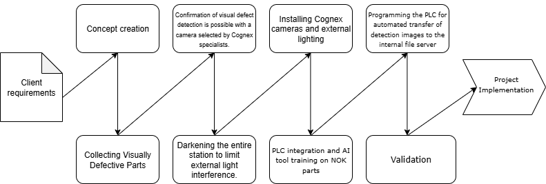

# AI Camera Detection – Implementation of a Neural Network-Based Camera System for Detecting Visual Defects on Finished Products.

*Date of creation: 2025-07-18*

## Project description

The project involves the implementation of an advanced vision system using industrial cameras powered by artificial intelligence (AI) to automatically detect visual defects on finished products on production lines. The main goal was to significantly enhance quality control and enable complete product traceability—including linking photographic documentation to the specific serial number of each product. This solution allows for storage and quick retrieval of images in the case of complaints or audits.

The system provides fully automated quality inspection for visual defects such as scratches, dents, abrasions, or pits. Additionally, it integrates label content inspection based on OCR (Optical Character Recognition) technology.

**Key components of the project:**

- **Cognex AI Cameras:**
Modern industrial Cognex cameras with AI functions were used, enabling automatic detection of defects, surface inspection, and label verification without affecting production line throughput.

- **Cognex Illuminators:**
Dedicated Cognex illuminators were implemented to ensure stable, uniform lighting conditions for all inspected surfaces. This significantly increases the effectiveness of detecting even the smallest visual defects and allows inspection of elements with varied structure and color.

- **Production Line Modification:**
Implementation required adapting production stations, including the installation of cameras, illuminators, and mechanical components for stable product positioning during inspection. Extensive testing, calibration of vision systems, and optimization of transport paths were performed.

- **PLC Integration:**
The vision system was integrated with the existing PLC control and production systems, enabling real-time quality analysis and automatic product parameter control.

- **Traceability Development:**
The solution allows for linking images to the specific serial number of each product. Photographic documentation is stored for a defined period, supporting efficient complaint resolution and compliance with industry requirements.

- **International Collaboration:**
The project was carried out in cooperation with teams from different regions and equipment suppliers, enabling the exchange of best practices and standardization of solutions on a global scale.

This project is an example of a modern approach to ensuring high production quality and full digital supervision of the manufacturing process using AI tools and automation.

## Project Workflow

