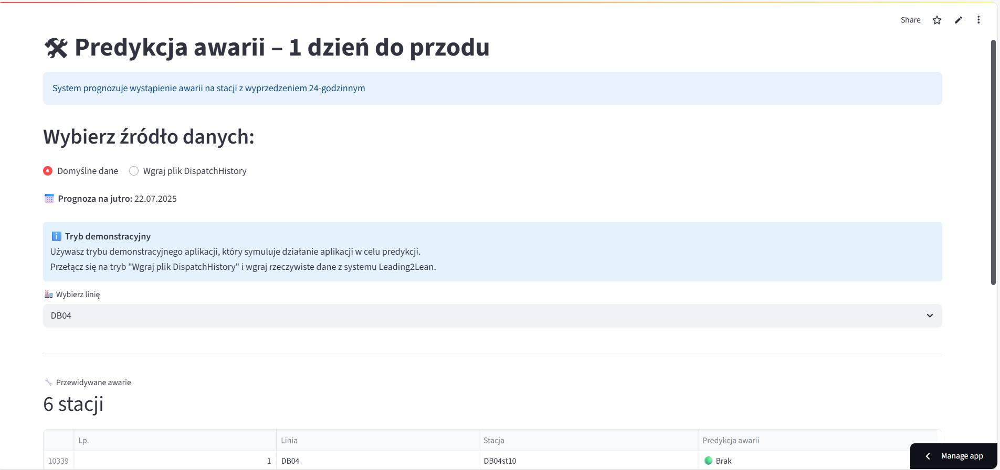
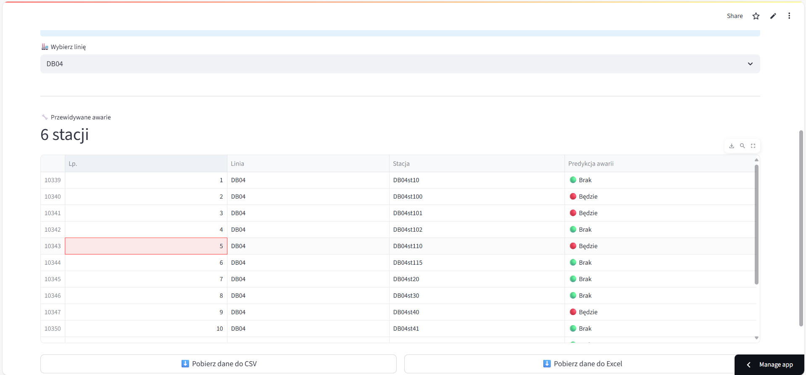
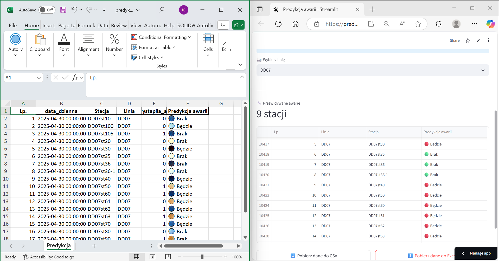
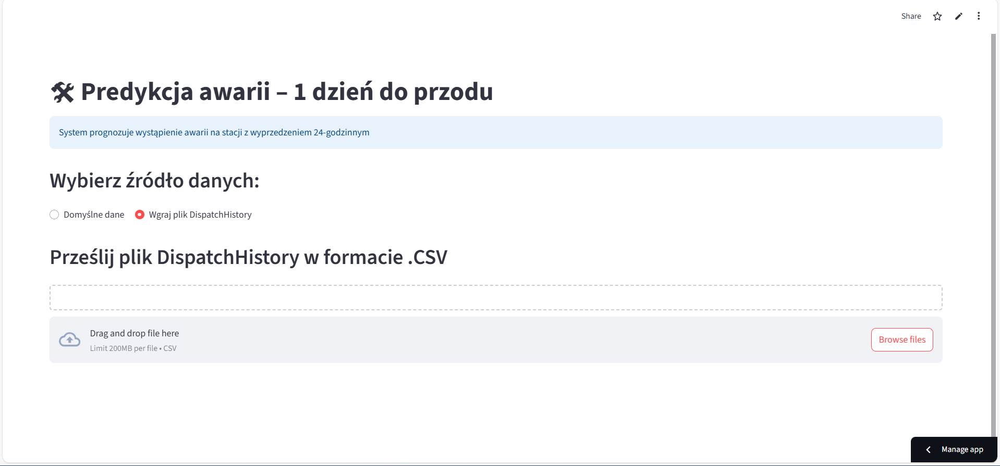
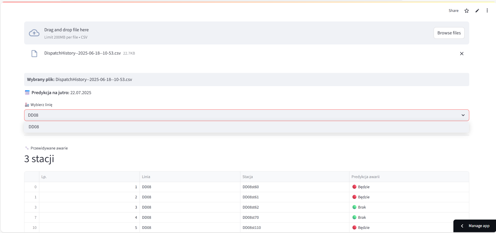

# AI-based Application for Failure Prediction in an Industrial Manufacturing Company

*Date of creation: 2025-06-06*

## Project description

The Application for Failure Prediction on Production Lines is an advanced, practical tool that leverages machine learning algorithms (LightGBM) to predict potential machine failures and downtime at assembly stations in an industrial environment.

The main goal of the application is to support maintenance teams and production staff in making preventive decisions, minimizing the risk of unexpected downtimes, and optimizing the operation of production lines. The system is designed for ease of use, high prediction accuracy, and the ability to be utilized on a daily basis without the need for specialized technical knowledge.

**Key components of the project:**

- **Use of Machine Learning:**  
  Prediction is based on a LightGBM model trained on historical failure reports and historical features (e.g., the number of failures in the last 7 days, days since last failure), sourced from the MES system.

- **Intuitive Interface (Streamlit):**  
  The user uploads a file with current data, runs the prediction with a single click, and receives a clear report with filtering and export options.

- **Automatic Data Preparation:**  
  The system automatically processes input data, ensures structural compatibility with the model requirements, and performs all necessary transformations—no manual file editing required.

- **Reporting and Export:**  
  Prediction results are presented in a clear table, with the option to download the report in CSV or Excel format for further analysis.

- **Effectiveness Confirmed by Testing:**  
  In practical tests in a production environment, the application demonstrated high prediction accuracy—there were no cases of missed actual failures, and false alarms were acceptable from a preventive maintenance perspective.

- **Prediction for Selected Production Lines (1-day in advance):**
  Enables reliable prediction of failures for selected production lines, providing insights one day in advance to support proactive maintenance decisions.

## Skills

- **Python** 
- **Pandas** 
- **NumPy** 
- **Scikit-learn** 
- **LightGBM** 
- **Matplotlib** 
- **Seaborn** 
- **Streamlit** 
- **KNIME** 

## Project structure

The project consists of several essential files, each responsible for a specific part of the prediction workflow:

- **app_dane_model_final_safe.py** – Main Python script; loads data, runs the prediction model, and generates results.
- **dane_predykcja_1dzien.csv** – Input dataset containing historical features for failure prediction.
- **model_predykcji_awarii_lightgbm.pkl** – Pre-trained LightGBM model for failure prediction (saved in pickle format).
- **README.md** – Project documentation and setup instructions.
- **requirements.txt** – List of required Python packages.

## Project Workflow

## Example Images from Application in Use

## Explore the app:

&nbsp;

