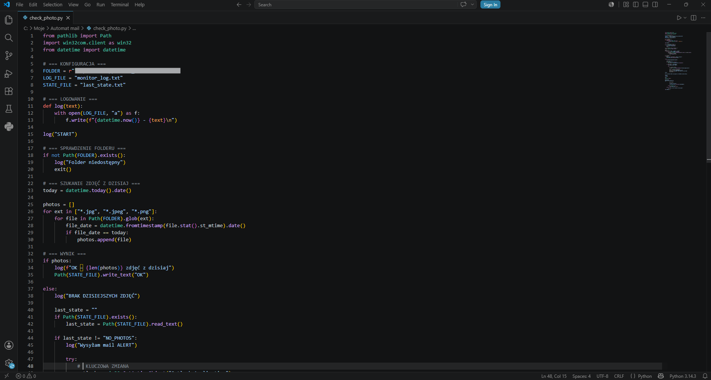
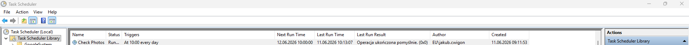
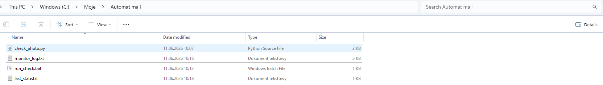
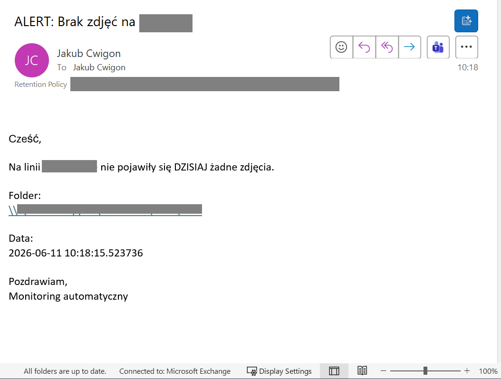
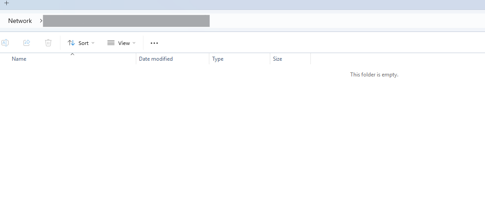

# Automated Image Monitoring System

*Date of creation: 2026-06-11*

## Automation System description

This project is an automated monitoring system developed for a manufacturing environment. The system continuously verifies whether necessary images are being taken and stored in a designated network folder as part of a production detection process.

The core functionality is based on a scheduled process that runs daily using Windows Task Scheduler. The script checks for image files created on the current day (e.g., .jpg, .jpeg, .png formats). If no new images are detected, the system triggers an alert mechanism.

To prevent redundant notifications, the system includes a state management mechanism that ensures alerts are sent only once per occurrence of an issue. Logging functionality is also implemented, providing a detailed execution history for troubleshooting and traceability.

The system integrates with Microsoft Outlook (via COM interface) to automatically send email notifications when a failure condition is detected. Due to corporate security constraints, the implementation ensures compatibility with enterprise environments by using an active Outlook session.

Overall, this solution improves production reliability by ensuring that the image capture process—critical for detection and quality control—is functioning correctly. It reduces manual monitoring effort and enables faster reaction to potential issues. The project demonstrates practical use of Python for industrial automation, task scheduling, file system monitoring, and integration with enterprise tools.

## Key features:

- **Automated daily monitoring:** Automatically verifies whether required images are taken and stored in a designated production folder on a daily basis.

- **Production process validation:** Ensures that the image capture process, critical for production detection and quality control, is functioning properly.

- **Smart alert system:** Sends notifications when no images are detected, with built-in anti-spam logic to avoid repeated alerts for the same issue.

- **Network folder integration:** Monitors image availability directly from a shared production server (e.g., network drive), enabling real-time validation without manual checks.

- **Detailed logging and traceability:** Maintains execution logs with timestamps for full visibility, diagnostics, and historical analysis.

- **Lightweight and fully automated:** Runs silently in the background via Windows Task Scheduler, requiring no user interaction or manual triggering.

- **Enterprise-ready integration:** Uses Microsoft Outlook (COM interface) for alerting, designed to operate within corporate IT environments and security constraints.

- **Scalable design:** Easily extendable to monitor multiple production lines or folders with minimal modifications.

## Example use cases:

- A production engineer schedules daily monitoring of image capture on a production line, ensuring that all required documentation photos are created automatically without manual checks.

- A maintenance technician investigates a camera failure after receiving an alert that no images were recorded during a shift, enabling faster identification of hardware or trigger issues.

- A quality engineer uses the system to verify that image-based detection processes were executed correctly during production runs, ensuring compliance with internal quality standards.

- A team leader reviews daily logs to confirm that all required images were captured, reducing the need for manual inspection of network folders.

- A process engineer identifies missing images caused by incorrect PLC or sensor configuration, allowing quick correction of detection triggers in the system.

## Skills

- **Python**
- **File System Monitoring (Pathlib)**
- **Windows Task Scheduler Integration**
- **Network Drive Handling (UNC paths)**
- **Automation & Process Monitoring**
- **Email Automation (Outlook COM Integration)**
- **Error Handling & Logging**
- **State Management (Anti-spam logic)**
- **Date-based File Filtering**
- **Debugging & System Troubleshooting**
- **Batch Script Integration (.bat execution)**
- **Enterprise Environment Adaptation**
- **Process Reliability & Quality Control Support**
- **Git & Version Control**

## Project structure

The project consists of several files and resources needed to run the Pre-Assembly Side Detector application:

- **check_photo.py** – Main Python script containing the core logic for monitoring the network folder, filtering images by date, handling state management, and triggering alerts.

- **run_check.bat** – Batch script used to execute the Python script in the correct environment and ensure proper integration with Windows Task Scheduler.

- **monitor_log.txt** – Log file that records system activity, execution timestamps, and detected issues for traceability and debugging purposes.

- **last_state.txt** – State file used to prevent repeated notifications by storing the last known condition of the system (e.g., no photos detected).

- **README.md** – Project documentation including system description, setup instructions, and usage details.

- **.gitignore** – Configuration file specifying which files and directories should be excluded from version control (e.g., logs, temporary files).

## Example Images from Automation in Use

