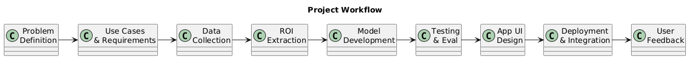
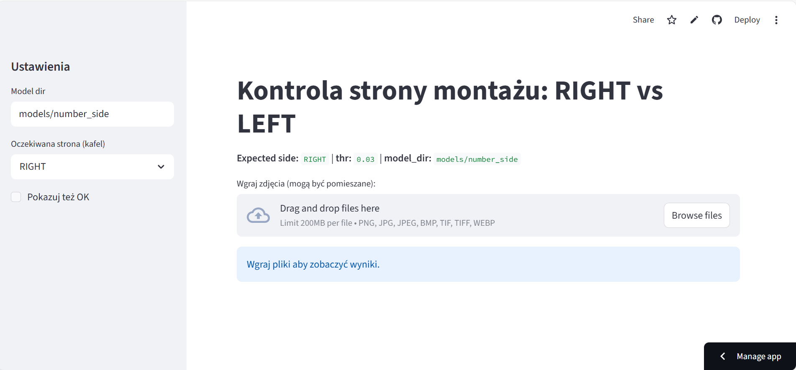
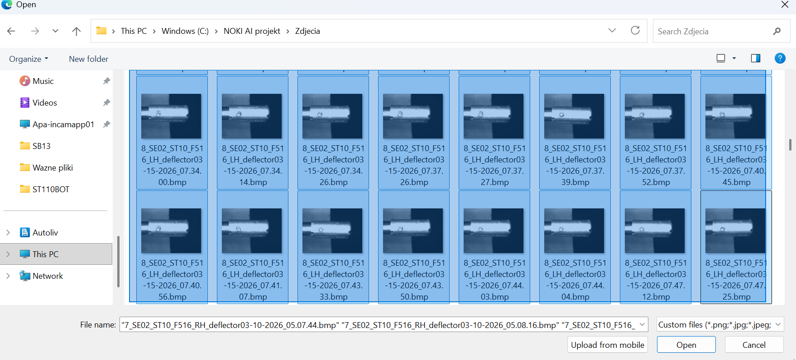
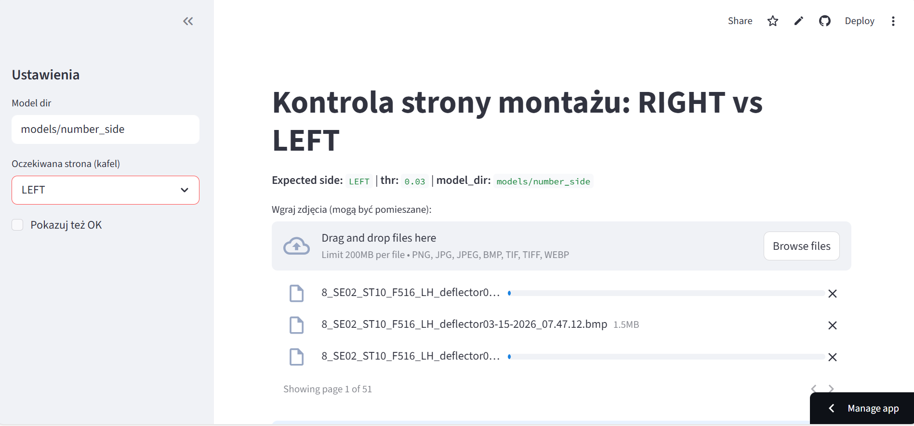
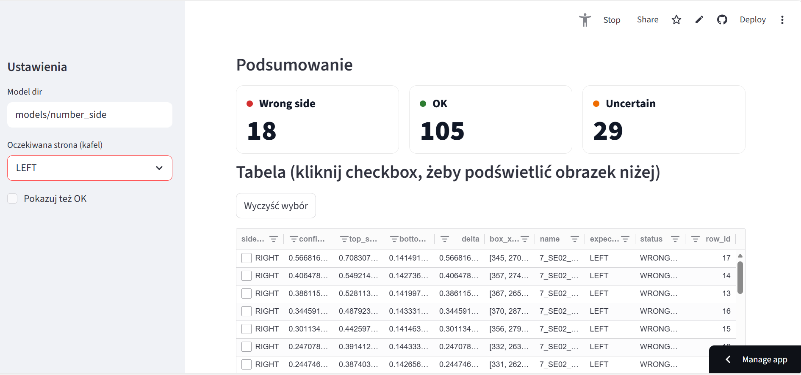
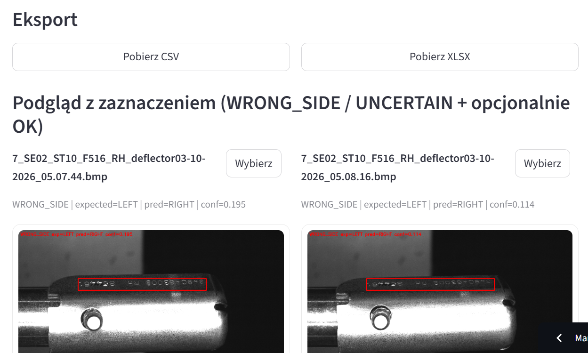
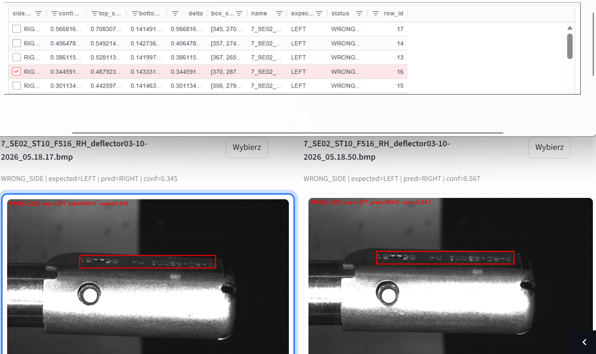
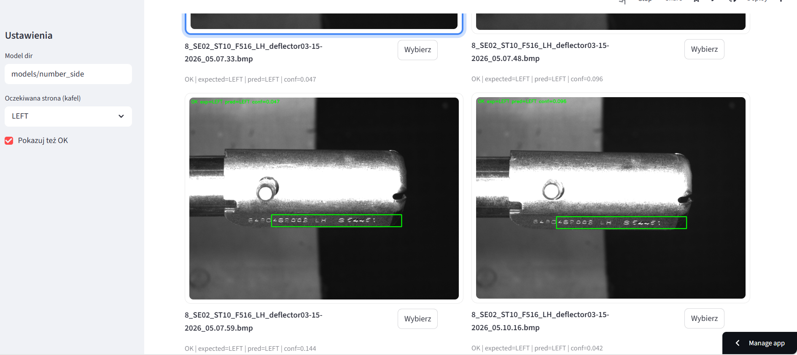
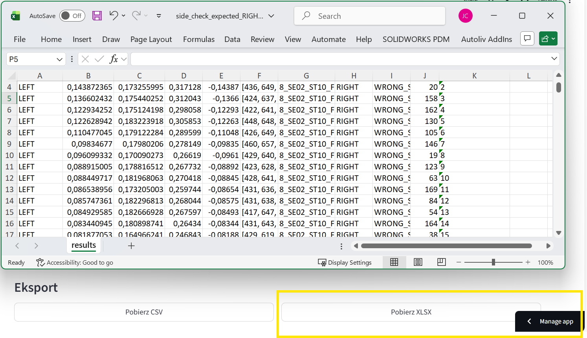

# Pre-Assembly Side Detector

*Date of creation: 2026-03-20*

## Application description

Pre-Assembly Correctness Detector is a modern web application (Streamlit) that enables fast and intuitive verification of assembly side correctness (LEFT/RIGHT) on photos of components—such as deflectors—even after they have already been installed.

The application utilizes images saved during the assembly process on an internal server, so you no longer need to physically retrieve products from the warehouse or carry out manual inspections by an operator. It allows you to upload up to 300-500 photos at once and automatically sorts and analyzes assembly correctness using advanced image analysis algorithms and machine learning models. You receive quick and clear feedback, which significantly streamlines quality control without the need for additional resources.

**Key features:**

- **Batch processing:** Instantly analyze and sort up to 1000 images of assembled components in a single run.
- **Automated side verification:** The tool automatically determines the correct assembly side (LEFT/RIGHT) for each item using advanced computer vision.
- **Clear image previews:** Review and validate results with interactive tables and visual overlays directly in your browser.
- **No manual inspection required:** Analysis is performed using archive photos from your internal server—no need to physically retrieve or check parts by hand.
- **Easy to use:** The application runs in your browser, requires no installation, and does not store user images after the analysis is complete.
- **AI-powered computer vision (custom OpenCV model):** Fast, reliable detection and classification, based on a template-matching model trained on thousands of real production images.

## Project Workflow

**How does it work?**

1. The user uploads up to 300-500 photos of assembled components directly from the company’s internal server.
2. The app processes all images, automatically analyzing and verifying the correct assembly side (LEFT/RIGHT) for each item.
3. The results are displayed in an interactive table—with status labels and visual overlays—making it easy to review and validate each case.
4. The user can instantly export the results for reporting, traceability documentation, or further quality control actions.

**Example use cases:**

- Virtual sorting of assembled parts—enabling remote quality verification without the need to physically return items to the factory.
- Additional validation of results from vision systems installed on the production line.
- Rapid detection of errors when equipment parameters (e.g., detection zones or thresholds) are misconfigured by maintenance staff.
- Batch quality inspection of production lots—reviewing hundreds or thousands of items at once for traceability and compliance reporting.
- Documentation and archiving of assembly correctness for audits or customer requirements.
- Supporting operator training by providing detailed feedback and visual examples of correct/incorrect mounting.
- Quick issue investigation or root-cause analysis after claims, defects, or suspected process deviations.

## Skills

- **Python**
- **Streamlit**
- **OpenCV**
- **NumPy**
- **Pandas**
- **st-aggrid**
- **Machine Learning (template matching, image classification)**
- **Custom Computer Vision Algorithms**
- **Image Processing**
- **UI/UX Design**
- **Git & Version Control**

## Project structure

The project consists of several files and resources needed to run the Pre-Assembly Side Detector application:

- **app.py** – Main Streamlit application file; handles image upload, batch processing, visual analysis, and results presentation.
- **side_model.py** – Module containing the core image analysis logic (template matching, region-of-interest extraction, classification).
- **requirements.txt** – List of Python package dependencies required to run the app (Streamlit, OpenCV, pandas, etc.).
- **README.md** – Project documentation and usage instructions.
- **.gitignore** – Specifies files and folders to be ignored by Git (e.g., temporary files, environment folders, large local data).
- **models/** – Directory containing trained template and configuration files for the assembly classifier.
- **example_images/** – Sample folder with example images for testing the application workflow.

## Example Images from Application in Use

## Explore the app:

&nbsp;

