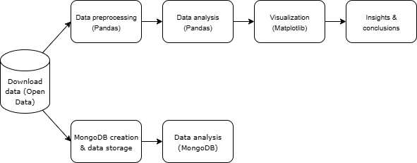

# Premier League Statistics Analysis (2021–2025)

*Date of creation: 2025-06-27*

## Project description

This project presents a comprehensive analysis of data from the English Premier League for the 2021–2025 seasons. The aim was to go through the entire data workflow – from acquisition, through processing and analysis, to visualization of results – using modern programming tools and NoSQL solutions.

**Key components of the project:**

- **NoSQL database:** I used MongoDB to store, efficiently search, and analyze match data. The project also demonstrates how to run queries on a NoSQL database and perform data analysis directly in MongoDB.
- **Python modules and classes:** The codebase is structured as modular Python files and classes, ensuring a clear and easily expandable program architecture.
- **Data acquisition (Open Data):** Match results and statistics were sourced from open data repositories.
- **Data analysis in Pandas:** I performed data exploration, aggregation, and statistical calculations using the Pandas library.
- **Data visualization:** Key findings and trends are presented as clear and informative charts generated in Python.

Through this project, I demonstrate in practice how to build custom Python modules, define classes, use NoSQL databases, acquire data from open sources, as well as analyze and search a MongoDB database, and present results in a clear visual form.

Additionally, as a football enthusiast, I have prepared interesting analyses that answer questions such as:

- Do referees favor home teams?
- Does home advantage really matter?
- Which teams committed the most fouls in particular seasons?
- Is the Premier League becoming more attacking-oriented each year?
- Based on available data, I have also calculated a simplified, popular in modern football xG (Expected Goals) metric.

## Skills

- **Python**  
- **Pandas**  
- **Matplotlib**  
- **MongoDB**  
- **MkDocs**  
- **Git**  
- **Visual Studio Code**  
- **Open Data**  

## Project structure

The project is organized into several Python modules and scripts, each responsible for a specific part of the analysis workflow:

- **main.py** – Entry point of the project; runs the full data analysis pipeline.
- **analiza.py** – Functions for data exploration and cleaning.
- **statystyki.py** – Computes match and season statistics.
- **wizualizacje.py** – Generates plots and visual summaries.
- **pobieranie.py** – Downloads data from open data sources.
- **mongodb_analiza.py** – Analysis and querying of the MongoDB NoSQL database.
- **mongo_utworz_baze.py** – Script for creating and populating the MongoDB database.
- **requirements.txt** – List of required Python packages.
- **README.md** – Project documentation and setup instructions.
- **.csv files** – Example input datasets.

All modules are well documented, and the code follows a modular structure for clarity and easy maintenance.

## Project Workflow

## Main analysis script

You can download the complete code and Jupyter notebook for this project here:

