# Premier League Statistics Analysis (2021–2025)

*Date of creation: 2025-06-27*

## Project description

This project presents a comprehensive analysis of data from the English Premier League for the 2021–2025 seasons. The aim was to go through the entire data workflow – from acquisition, through processing and analysis, to visualization of results – using modern programming tools and NoSQL solutions.

**Key components of the project:**

- **NoSQL database:** I used MongoDB to store, efficiently search, and analyze match data. The project also demonstrates how to run queries on a NoSQL database and perform data analysis directly in MongoDB.
- **Python modules and classes:** The codebase is structured as modular Python files and classes, ensuring a clear and easily expandable program architecture.
- **Data acquisition (Open Data):** Match results and statistics were sourced from open data repositories.
- **Data analysis in Pandas:** I performed data exploration, aggregation, and statistical calculations using the Pandas library.
- **Data visualization:** Key findings and trends are presented as clear and informative charts generated in Python.

Through this project, I demonstrate in practice how to build custom Python modules, define classes, use NoSQL databases, acquire data from open sources, as well as analyze and search a MongoDB database, and present results in a clear visual form.

Additionally, as a football enthusiast, I have prepared interesting analyses that answer questions such as:

- Do referees favor home teams?
- Does home advantage really matter?
- Which teams committed the most fouls in particular seasons?
- Is the Premier League becoming more attacking-oriented each year?
- Based on available data, I have also calculated a simplified, popular in modern football xG (Expected Goals) metric.

## Skills

- **Python**  
- **Pandas**  
- **Matplotlib**  
- **MongoDB**  
- **MkDocs**  
- **Git**  
- **Visual Studio Code**  
- **Open Data**  

## Project structure

The project is organized into several Python modules and scripts, each responsible for a specific part of the analysis workflow:

- **main.py** – Entry point of the project; runs the full data analysis pipeline.
- **analiza.py** – Functions for data exploration and cleaning.
- **statystyki.py** – Computes match and season statistics.
- **wizualizacje.py** – Generates plots and visual summaries.
- **pobieranie.py** – Downloads data from open data sources.
- **mongodb_analiza.py** – Analysis and querying of the MongoDB NoSQL database.
- **mongo_utworz_baze.py** – Script for creating and populating the MongoDB database.
- **requirements.txt** – List of required Python packages.
- **README.md** – Project documentation and setup instructions.
- **.csv files** – Example input datasets.

All modules are well documented, and the code follows a modular structure for clarity and easy maintenance.

## Project Workflow

## Preview of Jupyter Notebook

Below is a sample screenshot from the Jupyter Notebook where the analysis was performed:

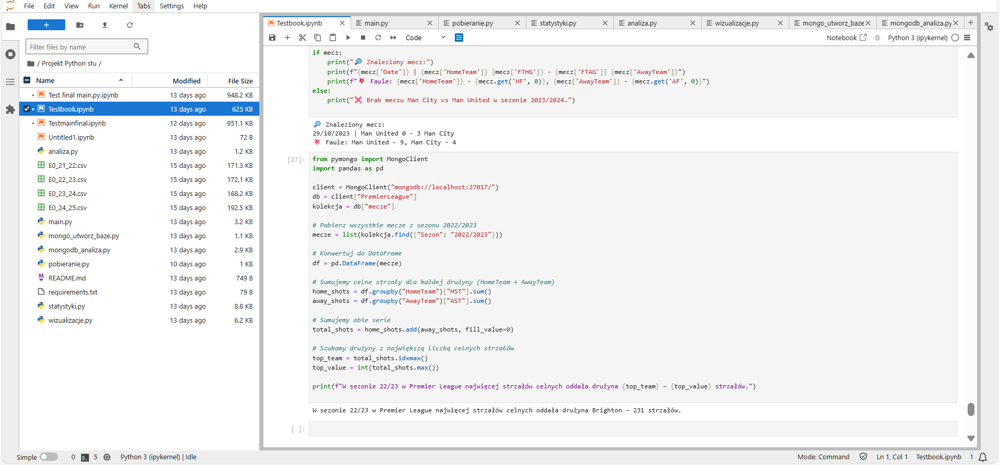

## Analysis Visualizations

### 1. Average goals per match (by season)

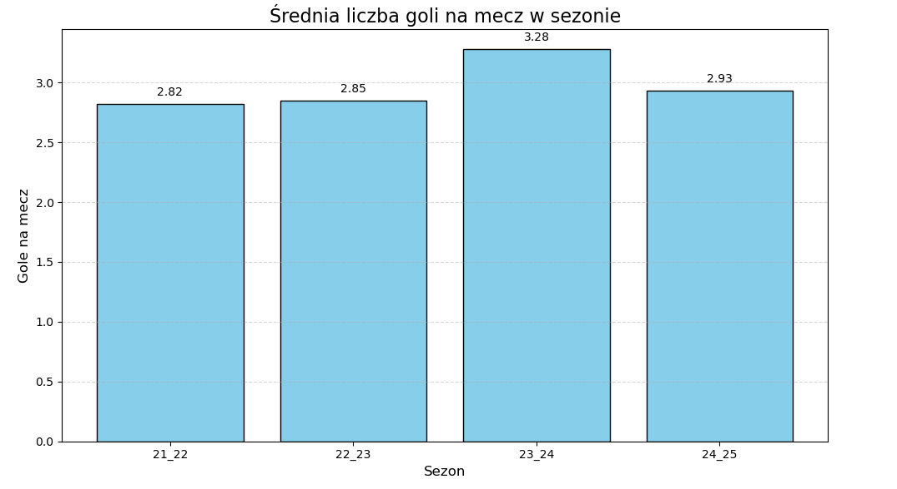

### 2. Fouls and Cards – Home vs Away Teams

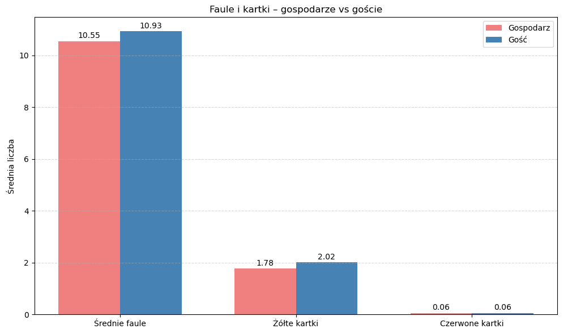

### 3. Percentage breakdown, who won? - Away / Home / Draw

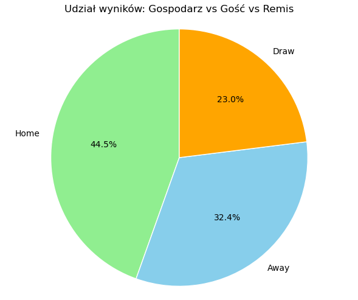

### 4. Average number of shots per match - Home vs. Away

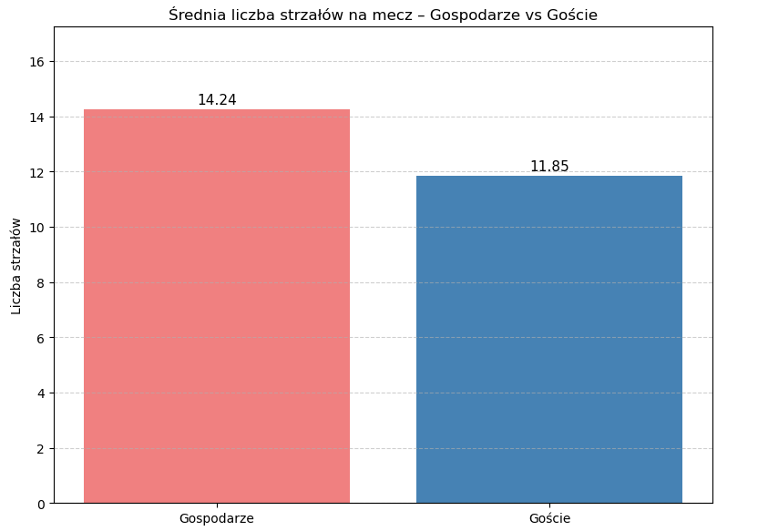

### 5. Shot Effectiveness (Accuracy) - Home vs. Away

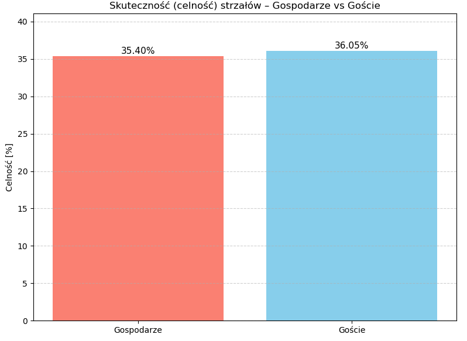

### 6. Average Shots: Home vs. Away

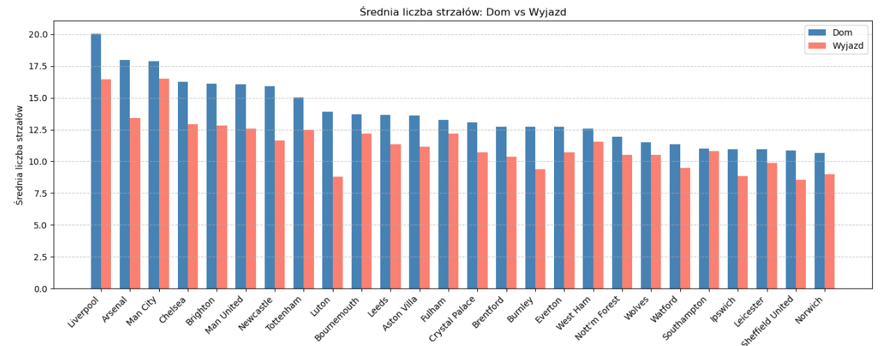

### 7. Shot Efficiency: Home vs. Away (On Target Percentage)

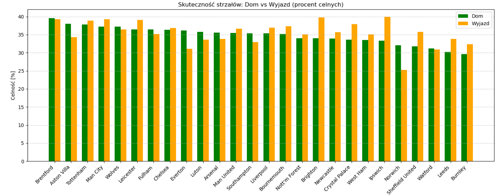

### 8. Number of goals scored by teams - 21/22 season

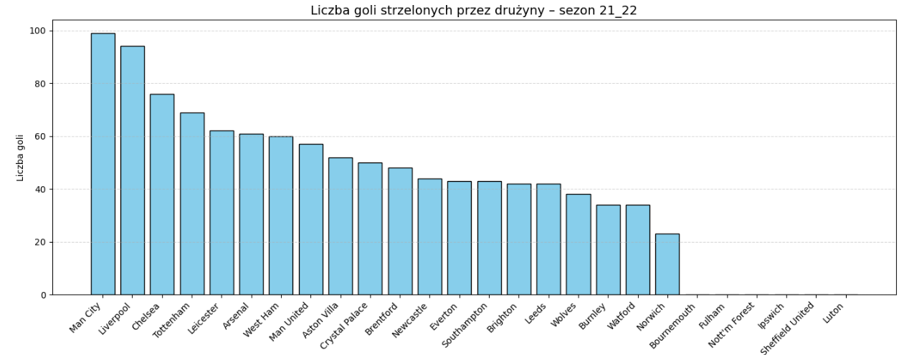

### 9. Number of goals scored by teams - 22/23 season

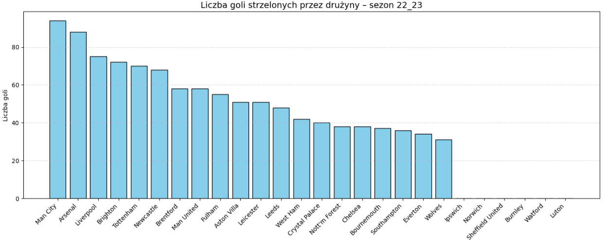

### 10. Number of goals scored by teams - 23/24 season

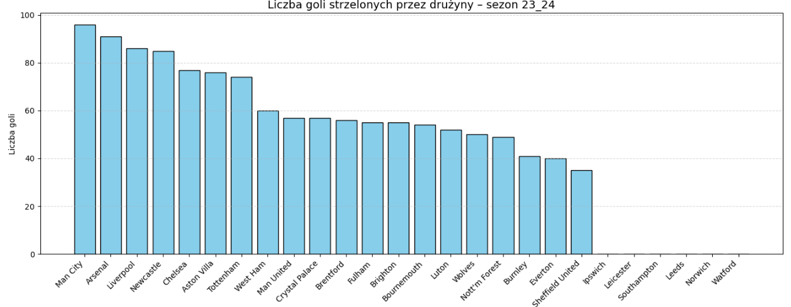

### 11. Number of goals scored by teams - 24/25 season

### 12. Simplified xG for the top 10 teams across seasons

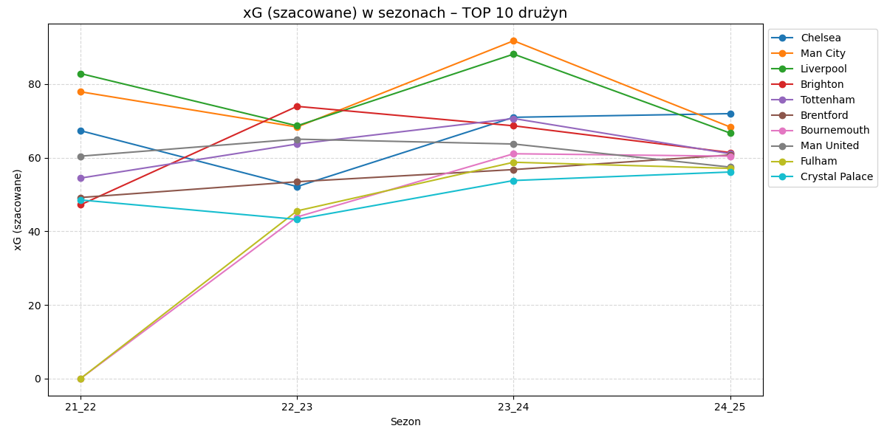

## Insights

### Graph 1.

- The average number of goals per match in the Premier League fluctuated between seasons 2021/22 and 2024/25.

- The highest scoring season was 2023/24, with an average of 3.28 goals per match.

- The other seasons showed more stability, with averages ranging from 2.82 to 2.93 goals per match.

- The noticeable increase in 2023/24 may indicate more attacking gameplay, weaker defenses, or both.

- Overall, the Premier League has maintained a high scoring rate, with the 2023/24 season standing out as especially offensive.

### Graph 2. 

- Away teams committed slightly more fouls on average (10.93) than home teams (10.55).

- Away teams also received more yellow cards per match (2.02) compared to home teams (1.78).

- The average number of red cards was the same for both home and away teams (0.06).

- These results suggest that away teams tend to play more aggressively or are penalized more often than home teams.

- There is no significant difference in red card distribution between home and away teams.

### Graph 3.

- Home teams won the highest proportion of matches (44.5%).

- Away teams won 32.4% of all matches.

- Draws occurred in 23.0% of matches.

- The data indicates a clear home advantage in the Premier League, with home teams winning significantly more often than away teams.

- Draws are less common than wins for either side, but still represent nearly a quarter of all outcomes.

### Graph 4.

- Home teams took an average of 14.24 shots per match.

- Away teams took an average of 11.85 shots per match.

- Home teams attempted significantly more shots than away teams.

- This suggests that home teams tend to be more offensive and create more chances during their matches.

- The data further supports the idea of a home advantage in Premier League games.

### Graph 5.

- Home teams had a shot accuracy of 35.40%.

- Away teams had a shot accuracy of 36.05%.

- The shot accuracy is very similar for both home and away teams.

- Away teams demonstrated a slightly higher shot accuracy, despite taking fewer total shots.

- This suggests that while home teams create more shooting opportunities, away teams may be more efficient with their chances.

### Graph 6.

- Most Premier League teams had a higher average number of shots when playing at home compared to away.

- Liverpool recorded the highest number of shots at home, followed by Arsenal and Manchester City.

- The difference between home and away shots is especially notable for top teams such as Liverpool, Arsenal, and Manchester City.

- For nearly all teams, playing at home resulted in more shooting opportunities than playing away.

- This trend highlights the advantage of playing on home ground, possibly due to better support and familiarity with the pitch.

- The smallest differences between home and away shots can be seen among teams lower in the table.

### Graph 7.

- The effectiveness (accuracy) of shots varies significantly between teams and between home and away matches.

- Some teams, like Brentford and Aston Villa, show higher shot accuracy at home.

- Other teams, such as Ipswich and Norwich, perform better in terms of shot accuracy when playing away.

- There is no universal pattern—while most teams have similar accuracy at home and away, a few display clear differences.

- These results may reflect tactical choices or psychological factors related to playing at home versus away.

- The overall differences are usually not drastic, indicating that accuracy is less affected by venue than shot volume.

### Graph 8.

- Manchester City was the highest-scoring team in the 2021/22 Premier League season, followed by Liverpool and Chelsea.

- Tottenham and Leicester also showed strong attacking performance with a high number of goals.

- Teams like Luton, Sheffield United, Ipswich, and Nottingham Forest scored the fewest goals this season.

- The distribution highlights a significant gap between top and bottom teams in terms of offensive strength.

- The majority of teams scored between 40 and 60 goals, indicating a competitive mid-table.

- The dominance of Manchester City and Liverpool reflects their attacking style and overall league performance.

### Graph 9.

- Manchester City again led the league in goals scored for the 2022/23 season, maintaining their position as the most offensive team.

- Arsenal and Liverpool followed closely, confirming their strong attacking play.

- Teams like Brighton, Tottenham, and Newcastle also performed well in terms of goals, showing a solid offensive approach.

- Chelsea dropped significantly in goal production compared to the previous season, finishing in the lower half of the table.

- The lowest goal tallies were recorded by teams such as Luton, Watford, Burnley, and Sheffield United.

- There was a more even distribution of goals among mid-table teams compared to the previous season, indicating increased competition.

- The gap between the top-scoring and bottom-scoring teams remained notable, with the top clubs dominating offensively.

### Graph 10.

- Manchester City retained their position as the top-scoring team for the 2023/24 season.

- Arsenal and Liverpool continued to show strong offensive performance, closely following Manchester City.

- Newcastle and Chelsea improved their goal tallies compared to the previous season, placing among the top scorers.

- Aston Villa and Tottenham also maintained solid attacking outputs.

- Teams such as West Ham, Manchester United, and Crystal Palace finished in the mid-table in terms of goals scored.

- The lowest goal counts were recorded by teams like Sheffield United, Ipswich, Leicester, Southampton, Leeds, Norwich, and Watford.

- The distribution of goals suggests a strong dominance by top clubs, but with several mid-table teams closing the gap in attacking output.

- The trend of high-scoring teams remains consistent over the seasons, highlighting the sustained quality of leading offensive sides.

### Graph 11.

- Liverpool led the league in goals scored during the 2024/25 season, overtaking Manchester City.

- Manchester City, Arsenal, and Newcastle also maintained high-scoring performances, consistently appearing among the top teams.

- Brentford, Brighton, and Tottenham showed competitive offensive output, closely following the leaders.

- Teams like Chelsea, Aston Villa, Nottingham Forest, Bournemouth, and Wolves remained solidly in the middle of the pack.

- The lower end of the chart features teams such as Sheffield United, Burnley, Watford, Luton, Norwich, Leeds, Leicester, and Southampton, who struggled to score as many goals as the league leaders.

- The gap between the highest- and lowest-scoring teams appears to persist, underlining the offensive dominance of top Premier League clubs.

- Compared to previous seasons, Liverpool made a notable leap to become the top-scoring team, while several mid-table teams maintained or slightly improved their attacking statistics.

### Graph 12.

- Manchester City and Liverpool consistently ranked among the top teams in estimated xG, with both peaking in the 2023/24 season before dropping in 2024/25.

- Chelsea and Tottenham maintained stable xG values, showing moderate improvement towards the last two seasons.

- Brighton demonstrated a significant rise in xG in the 2022/23 and 2023/24 seasons, indicating an increasingly attacking playing style.

- Brentford, Bournemouth, and Fulham all displayed upward trends, with noticeable improvements in their estimated xG, especially after the first season.

- Man United and Crystal Palace exhibited stable but comparatively lower xG values throughout all seasons.

- For most teams, the highest xG was recorded in the 2023/24 season, suggesting a particularly offensive year in the Premier League.

- The following 2024/25 season saw a slight decline in xG for nearly all top 10 teams, possibly reflecting more defensive tactics or improved defensive performances league-wide.

## Main Analysis Script

You can download the complete code and Jupyter notebook for this project here:

